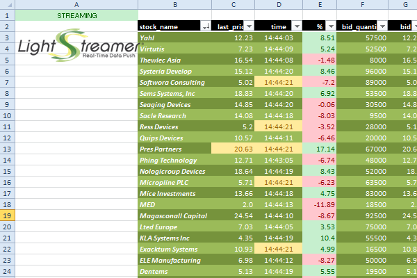

# Lightstreamer - Basic Stock-List Demo - Excel (RTD) Client
<!-- START DESCRIPTION lightstreamer-example-stocklist-client-rtd -->

This project includes a demo client showing integration between [.NET client API for Lightstreamer](http://www.lightstreamer.com/docs/client_dotnet_api/frames.html) and <b>RTD Server</b> for Excel.
## Live Demo

[](http://demos.lightstreamer.com/DotNet_RTDDemo/RTDLibraryExcelDemoSetup.msi)<br>
###[ View live demo](http://demos.lightstreamer.com/DotNet_RTDDemo/RTDLibraryExcelDemoSetup.msi)<br>
(download RTDLibraryExcelDemoSetup.msi; launch it; follow the instructions)

## Details

[Real-Time Data (RTD)](http://en.wikipedia.org/wiki/Microsoft_Excel#Using_external_data) is a technology introduced in Microsoft Excel starting from 2002, aimed at replacing DDE for updating spreadsheets in real time.<br>
This demo is made up of a DLL library that acts as an RTD Server, which receives updates from Lightstreamer Server on one side and injects them into Excel on the other side. The library has been developed with C#.NET (full source code is provided, see below). It leverages the <b>.NET Client API for Lightstreamer</b> to subscribe to 30 stock items and the <b>Microsoft Office library</b> to set up the RTD server.

The control windows shows a counter with the updates received from Lightstreamer Server and logs such updates in real time. Is also shows the notifications issued towards Excel. To pause the notification calls, uncheck "Data stream to Excel".

### Dig the Code

The main class is RtdServer, found in RtdServer.cs, which contains an implementation of the IRtdServer interface. The same class will load a Form showing information regarding lightstreamer updates coming in and Excel updates pushed out.
LightstreamerClient.cs, StocklistConnectionListener.cs and StocklistHandyTableListener.cs contain classes used to interface to the Lightstreamer .NET Client library, as seen in the .NET StockListDemo project.
  
Check out the sources for further explanations.

<i>NOTE: not all the functionalities of the Lightstreamer .NET/C# Client & Local RTD Server for Excel demo are exposed by the classes listed above. You can easily expand those functionalities using the .NET/C# Client API as a reference: [http://www.lightstreamer.com/docs/client_dotnet_api/frames.html](http://www.lightstreamer.com/docs/client_dotnet_api/frames.html).</i>

<!-- END DESCRIPTION lightstreamer-example-stocklist-client-rtd -->

## Install

* Note that, as prerequisite, the [Lightstreamer - Stock- List Demo - Java Adapter](https://github.com/Weswit/Lightstreamer-example-Stocklist-adapter-java) has to be deployed on your local Lightstreamer Server instance. Please check out that project and follow the installation instructions provided with it.
* Launch Lightstreamer Server.
* You need Microsoft Excel 2007 or newer installed on your Windows PC.
* Download the deploy.zip file that you can find in the [deploy release](https://github.com/Weswit/Lightstreamer-example-StockList-client-rtd/releases) of this project and extract the application installer (a ".msi" file).
* Execute the downloaded file to install the application.
* From the Start menu, go to the "Lightstreamer RTD Demo" folder, click the "Start Lightstreamer Excel RTD Server Demo" link. This will open Excel and automatically load the "ExcelDemo_local.xlsx" spreadsheet (which, by the way, is contained in "C:\Program Files (x86)\Lightstreamer .NET RTD Server Demo library for Excel\").
* The spreadsheet will activate the Lightstreamer RTD library, which will open a control window, where you can see the data traffic.<br>


In the Excel spreadsheet, you will see several cells changing in real time. If the update rate looks slow (that is, you don't see several updates in a second), it means that the RTD ThrottleInterval of Excel is set to a high value. In order to activare real-time dispatching, please follow these instructions:
* In Excel, go to the Visual Basic Editor (by pressing ALT+F11 or clicking Visual Basic Editor from the Macro menu (Tools menu).
* Open the Immediate window (press CTRL+G or click Immediate Window on the View menu).
* In the Immediate window type this code and press ENTER: Application.RTD.ThrottleInterval = 0

## Build

Otherwise, in order to compile the project, a version of Excel implementing RTD features must be installed (usually Excel 2007, 2010+). For more information regarding the RTD technology please visit this [page](http://social.msdn.microsoft.com/Search/en-us?query=RTD).
For more information regarding Visual C# 2010 Express and how to run it, please go to: [http://www.microsoft.com/express/Downloads/#2010-Visual-CS](http://www.microsoft.com/express/Downloads/#2010-Visual-CS).
  
<i>NOTE: You may also use the sources included in this project with another Microsoft IDE or without any IDE but such approach is not covered in this readme.</i>

You just need to create a Visual Studio project for a Class library (DLL) target, then include the sources and properties files and include references to the Microsoft.Office.Interop.Excel and Lightstreamer.NET Client API (binaries files DotNetClient_N2.dll and DotNetClient_N2.pdb that are located under the /DOCS-SDKs/sdk_client_dotnet/lib folder Lightstreamer) from the [latest Lightstreamer distribution](http://www.lightstreamer.com/download). After the compilation of your DLL, you need to run RegAsm.exe tool in order to register it against COM. RegAsm.exe is part of the .NET SDK and just generates some Registry entries, like the ones in the example RTDServiceRegistrationExample.reg file.

### Run
Once RTDLibraryExcelDemo.dll is registered, ExcelDemo.xlsx has to be opened.
If the registration went successful, Excel will load RTDLibraryExcelDemo.dll, a status window will appear and real-time data will start to be delivered to it. A quick and easy way to avoid dealing with Registry entries is to install the shipped version of the library with the downloadable [RTDLibraryExcelDemoSetup.msi](http://demos.lightstreamer.com/DotNet_RTDDemo/RTDLibraryExcelDemoSetup.msi), then just
compile your own .dll replacing the one installed.

### Deploy
  
Please note that the RTD technology works on top of <b>DCOM</b>, this means that you could even deploy a centralized remote RTD Server that can be used across your network. In the case of this demo, both RTD Server and Excel will run on the same local computer.
Internet connection is required to make the RTD Server, controlling a Lightstreamer connection, being able to deliver real-time data to Excel.<br>

Obviously you could test the application against your Lightstreamer server installed somewhere, but in this case, you have to change the paramters of RTD function in A1 cell of the Excel sheet, please note the forth and fifth parameters:

```
=RTD("lightstreamer.rtdexceldemo";;"CONFIG";"http://push.lightstreamer.com";"80";"DEMO";"QUOTE_ADAPTER")
```

The example requires the [QUOTE_ADAPTER](https://github.com/Weswit/Lightstreamer-example-Stocklist-adapter-java) and [LiteralBasedProvider](https://github.com/Weswit/Lightstreamer-example-ReusableMetadata-adapter-java), so if you you want targetting your local Lightstreamer server, those Adapters have to be deployed in it.
The factory configuration of Lightstreamer server already provides this adapter deployed.<br>

## See Also

### Lightstreamer Adapters Needed by These Demo Clients
<!-- START RELATED_ENTRIES -->

* [Lightstreamer - Stock-List Demo - Java Adapter](https://github.com/Weswit/Lightstreamer-example-Stocklist-adapter-java)
* [Lightstreamer - Reusable Metadata Adapters - Java Adapter](https://github.com/Weswit/Lightstreamer-example-ReusableMetadata-adapter-java)

<!-- END RELATED_ENTRIES -->

### Related Projects

* [Lightstreamer - Stock-List Demos - HTML Clients](https://github.com/Weswit/Lightstreamer-example-Stocklist-client-javascript)
* [Lightstreamer - Basic Stock-List Demo - jQuery (jqGrid) Client](https://github.com/Weswit/Lightstreamer-example-StockList-client-jquery)
* [Lightstreamer - Stock-List Demo - Dojo Toolkit Client](https://github.com/Weswit/Lightstreamer-example-StockList-client-dojo)
* [Lightstreamer - Basic Stock-List Demo - .NET Client](https://github.com/Weswit/Lightstreamer-example-StockList-client-dotnet)
* [Lightstreamer - Basic Stock-List Demo - Java SE (Swing) Client](https://github.com/Weswit/Lightstreamer-example-StockList-client-java)

## Lightstreamer Compatibility Notes #

* Compatible with Lightstreamer .NET Client Library version 2.1 or newer.
* For Lightstreamer Allegro (+ .NET Client API support), Presto, Vivace.
