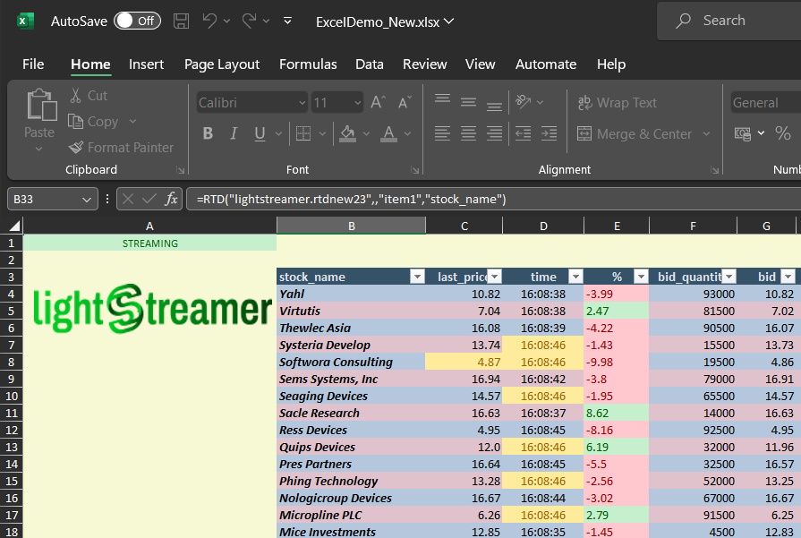

# Lightstreamer - Basic Stock-List Demo - Excel (RTD) Client
<!-- START DESCRIPTION lightstreamer-example-stocklist-client-rtd -->

This project includes a demo client showing integration between [.NET Standard client API for Lightstreamer](https://www.nuget.org/packages/Lightstreamer.DotNetStandard.Client/) and <b>RTD Server</b> for Excel.

## Live Demo

<br>

## Details

[Real-Time Data (RTD)](http://en.wikipedia.org/wiki/Microsoft_Excel#Using_external_data) is a technology introduced in Microsoft Excel starting from 2002, aimed at replacing DDE for updating spreadsheets in real-time.<br>
This demo is made up of a DLL library that acts as an RTD Server, which receives updates from Lightstreamer Server on one side and injects them into Excel on the other side.
The library has been developed with C# (full source code is provided, see below).
It leverages the <b>.NET Standard Client API for Lightstreamer</b> to subscribe to 30 stock items and the [Microsoft.Office.Interop.Excel](https://www.nuget.org/packages/Microsoft.Office.Interop.Excel) to set up the RTD server.

### Dig the Code

The main class is RtdServer, found in RtdServer.cs, which contains an implementation of the IRtdServer interface that serves as a bridge for communication between Excel and the Lightstreamer server.

The RTD function (https://learn.microsoft.com/en-us/office/troubleshoot/excel/set-up-realtimedata-function) uses the following syntax

```
=RTD(RealTimeServerProgID,ServerName,Topic1,[Topic2], ...)
```

So, the first parameter is the identifier of the RTD server installed on the local system who will provide the data.
It is registered in the C# code of for this demo is defined as: <i>lightstreamer.rtdnew23</i> []()  
The ServerName paramter is not used by the demo and the following parameters are a free list of values called topics which should represent the value required by the excel sheet to valorise the cells.
In the demo the first topic of the list is used as selector. 

The 'CONFIG' value is a special case that once received by the RTDServer triggers the connection to the Lightstreamer server.
Please look at A1 cell in the Excel sheet:

```
=rtd("lightstreamer.rtdnew23",,"CONFIG","http://localhost","8080","WELCOME","STOCKS","user_test","o93ujDNJasf,ajfih393!_ard3sfaklj_sjsijhdf3934eifaskik(2332334yh32rdusjdsshkahkhgfasif24egfwebkjbcfasik")
```

The demo uses the values of the other topics to initialize the connection, respectively:
 - Lightstreamer server url (Topic2),
 - port number (Topic3),
 - Adapter Set name (Topic4),
 - Data Adapter name (Topic5),
 - user (Topic6),
 - password (Topic7).
 
And return the current status of the connection with the Lightstreamer server.

The 'OPTIONS' value is a special case that once received by the RTDServer leverages some specific tuning for Lightstreamer.
Currently it is possible to configure:
 - the max frequency for each subscriptions, `max_frequency`: [Subscription.RequestedMaxFrequency](https://sdk.lightstreamer.com/ls-dotnetstandard-client/6.0.0/api/api/com.lightstreamer.client.Subscription.html#com_lightstreamer_client_Subscription_RequestedMaxFrequency)
 - the transport for the comunication with the Lightstreamer server, `forced_transport`: [ConnectionOptions.ForcedTransport](https://sdk.lightstreamer.com/ls-dotnetstandard-client/6.0.0/api/api/com.lightstreamer.client.ConnectionOptions.html#com_lightstreamer_client_ConnectionOptions_ForcedTransport)
 - the stalled timeout, `stalled_timeout`: [ConnectionOptions.StalledTimeout](https://sdk.lightstreamer.com/ls-dotnetstandard-client/6.0.0/api/api/com.lightstreamer.client.ConnectionOptions.html#com_lightstreamer_client_ConnectionOptions_StalledTimeout)
 - a proxy, `proxy`: [ConnectionOptions.Proxy](https://sdk.lightstreamer.com/ls-dotnetstandard-client/6.0.0/api/api/com.lightstreamer.client.ConnectionOptions.html#com_lightstreamer_client_ConnectionOptions_Proxy)

Instead, regarding the cells in the demo with stock market tickers, the formula is as follows:

```
=rtd("lightstreamer.rtdnew23",,"item1","stock_name")
```

where Topic1 and Topic2 are respectively the name of the Item and the field we want to display in the cell.

LSConnect.cs, StocklistConnectionListener.cs, and StocklistSubListener.cs contain classes used to interface to the Lightstreamer .NET Standard Client library.

The Demo produces a log file, <i>TestRTD.log</i>, with information about the interaction both with the Excel sheet and the Lightsgtreamer server.
Check out the sources for further explanations.

<i>NOTE: Not all the functionalities of the Lightstreamer .NET Client & Local RTD Server for Excel demo are exposed by the classes listed above. You can easily expand those functionalities using the PCL/C# Client API as a reference: [http://www.lightstreamer.com/api/ls-pcl-client/latest/](http://www.lightstreamer.com/api/ls-pcl-client/latest/).</i>

<!-- END DESCRIPTION lightstreamer-example-stocklist-client-rtd -->

## Install

If you want to install a version of this demo pointing to your local Lightstreamer Server, follow these steps:

 - Note that, as prerequisite: 
	 - You need a Lightstreamer server installed locally, [download](https://lightstreamer.com/download/).
	 - You need Microsoft Excel 2007 or newer installed on your Windows system.
	 - You need [.NET 7](https://dotnet.microsoft.com/en-us/download/dotnet/7.0) installed on your Windows system.
 - launch Lightstreamer Server.
 - Download the deploy.zip file that you can find in the deploy release of this project and extract the `TestRTD` folder.
 - Execute the `ExcelDemoLauncher.bat` command bat from the `net7.0` or `net7.0-x64` folder depending your Excel is 32 or 64 bit.
	- Since a dll registration is involved the batch file should be launched with administrator privileges.
 - The spreadsheet will activate the Lightstreamer RTD library, and several cells will start changing in real-time.

## Build

<i>NOTE: You may also use the sources included in this project with another Microsoft IDE or without any IDE but such an approach is not covered in this readme.</i>

The project also includes a solution and a project designed for Visual Studio, we used the 2022 version.
Just build the Lightstreamer-example-StockList-client-rtd project to get the dll ready to use.
The reference framework for the project is net7.0 and it is also necessary to specify the target platform (x86 or x64) according to the version of Excel installed.
The RTD server contained in the dll must be COM registered in order to activate. The following commands must be executed from an elevated command prompt:

```
Register:    regsvr32.exe Lightstreamer-example-StockList-client-rtd.comhost.dll
Unregister:    regsvr32.exe /u Lightstreamer-example-StockList-client-rtd.comhost.dll
```

### Run
Once `Lightstreamer-example-StockList-client-rtd.comhost.dll` is registered, `ExcelDemo_New.xlsx` has to be opened.
If the registration was successful, Excel will load the RTD server, and real-time data will start to be delivered to it.

### Deploy
  
Please note that the RTD technology works on top of <b>DCOM</b>, this means that you could even deploy a centralized remote RTD Server that can be used across your network. In the case of this demo, both RTD Server and Excel will run on the same local computer.
Internet connection is required to make the RTD Server, controlling a Lightstreamer connection, being able to deliver real-time data to Excel.<br>

Obviously, you could test the application against your Lightstreamer server installed somewhere, but in this case, you have to change the paramters of RTD function in `A1` cell of the Excel sheet.

## See Also

### Lightstreamer Adapters Needed by These Demo Clients
<!-- START RELATED_ENTRIES -->

* [Lightstreamer - Stock-List Demo - Java Adapter](https://github.com/Lightstreamer/Lightstreamer-example-Stocklist-adapter-java)
* [Lightstreamer - Reusable Metadata Adapters - Java Adapter](https://github.com/Lightstreamer/Lightstreamer-example-ReusableMetadata-adapter-java)

<!-- END RELATED_ENTRIES -->

### Related Projects

* [Lightstreamer - Stock-List Demos - HTML Clients](https://github.com/Lightstreamer/Lightstreamer-example-Stocklist-client-javascript)
* [Lightstreamer - Basic Stock-List Demo - jQuery (jqGrid) Client](https://github.com/Lightstreamer/Lightstreamer-example-StockList-client-jquery)
* [Lightstreamer - Stock-List Demo - Dojo Toolkit Client](https://github.com/Lightstreamer/Lightstreamer-example-StockList-client-dojo)
* [Lightstreamer - Basic Stock-List Demo - .NET Client](https://github.com/Lightstreamer/Lightstreamer-example-StockList-client-dotnet)
* [Lightstreamer - Basic Stock-List Demo - Java SE (Swing) Client](https://github.com/Lightstreamer/Lightstreamer-example-StockList-client-java)

## Lightstreamer Compatibility Notes #

* Compatible with Lighstreaer .NET Standard Client since version [6.0](https://www.nuget.org/packages/Lightstreamer.DotNetStandard.Client/)
* Compatible with [.NET 7](https://dotnet.microsoft.com/en-us/download/dotnet/7.0)
* For a version of this demo compatible with Lightstreamer .NET PCL Client Library version 3.0.0 or lower please check out this tag [deploy_pcl](https://github.com/Lightstreamer/Lightstreamer-example-StockList-client-rtd/tree/deploy_pcl).
* Ensure that .NET Standard Client API is supported by Lightstreamer Server license configuration.
